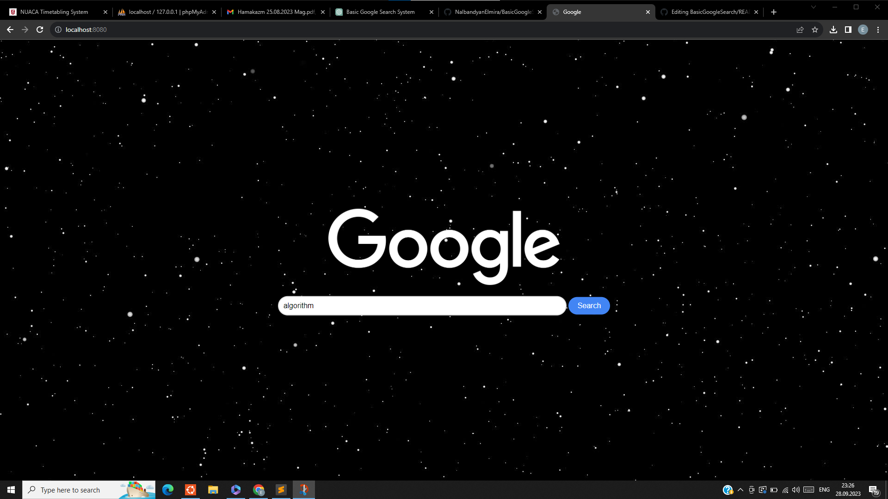
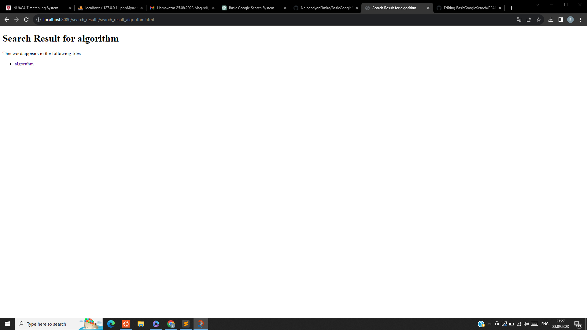
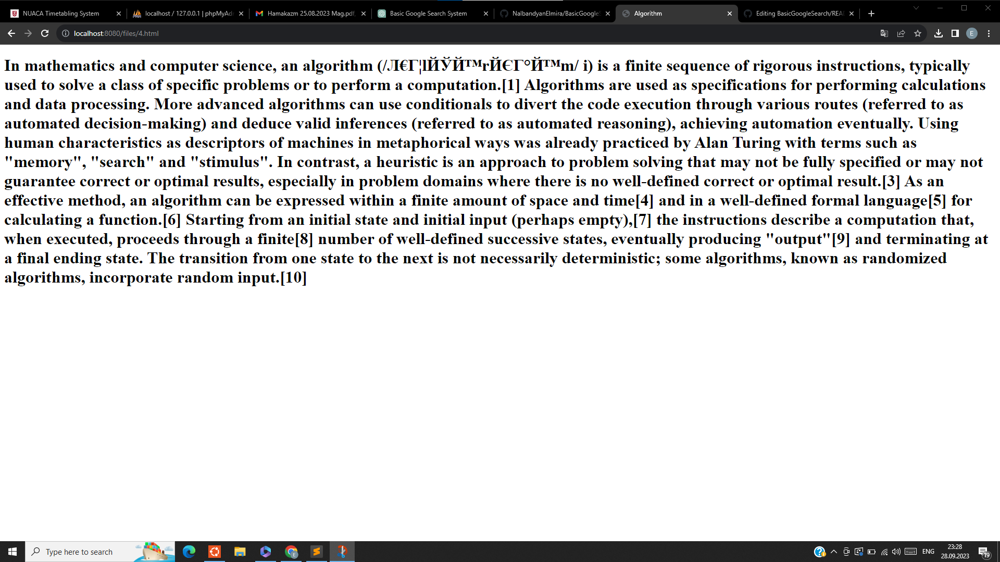

# BasicGoogleSearch

The Basic Google search project is a simple search engine that indexes words from HTML files, allows users to search for specific words, and displays search results.

## Table of Contents

- [About](#about)
- [Getting Started](#getting-started)
  - [Prerequisites](#prerequisites)
  - [Installation](#installation)
- [Usage](#usage)
- [Project Structure](#project-structure)
- [Screenshots](#screenshots)

## About

The Basic Google Search project is a basic search engine developed as a learning project. It includes components such as Indexer, QueryProcessor, Server, ValidWords, and DB classes to index words from HTML files, store them in a database, and provide a simple search interface to users.

## Getting Started

### Prerequisites

Before running the project, make sure you have the following prerequisites:

- C++ compiler
- SQLite3 library

### Installation

To set up the project, follow these steps:

1. Clone the repository to your local machine:

   ```bash
   git clone https://github.com/NalbandyanElmira/BasicGoogleSearch.git
   ```
2. Build the project:
   ```bash
   g++ main.cpp -std=c++11 -lsqlite3
   ```
   ```bash
   ./a.out
   ```

### Usage
To use the Basic Google Search, follow these steps:

- Start the server by running the executable.

- Access the search interface by opening a web browser and navigating to http://localhost:8080.

- Enter a search query in the input field and click the "Search" button.

- View the search results displayed on the web page.

### Project Structure
The project's structure includes the following main components:

- `ValidWords:` Manages a list of valid words to index.
- `Indexer:` Indexes words from HTML files.
- `DB:` Manages the database for storing word and file associations. 
- `QueryProcessor:` Processes user search queries and retrieves results.
- `Server:` Handles HTTP requests and serves web pages.

## Screenshots


*Home Page of the Search Engine*


*Search Results Page*


*Searched Page*
